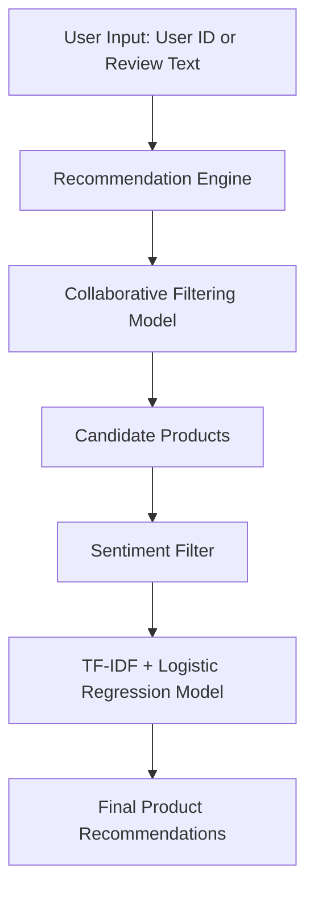

# 🛒 Sentiment-Based Product Recommendation System 💡

> **An intelligent, sentiment-aware recommendation engine** that suggests products to users based on historical preferences and sentiment analysis of product reviews.  
> Built with **TF-IDF + Logistic Regression** for lightweight CPU-friendly predictions 🚀.

---

## 📌 Table of Contents
1. [✨ Overview](#-overview)
2. [🎯 Features](#-features)
3. [📊 Architecture](#-architecture)
4. [⚙ Installation & Setup](#-installation--setup)
5. [🧪 Running Tests](#-running-tests)
6. [🚀 How to Run](#-how-to-run)
7. [📂 Project Structure](#-project-structure)
8. [🛠 Tech Stack](#-tech-stack)
9. [📈 Future Enhancements](#-future-enhancements)
10. [🏆 Acknowledgements](#-acknowledgements)

---

## ✨ Overview

This project combines **recommendation systems** and **natural language processing** to deliver **personalized product suggestions**.

It doesn’t just recommend products based on past purchases — it also checks **how positively or negatively other users felt** about them.

✅ Example: If you love headphones, the system won't just recommend *any* headphones — it will recommend **those with high positive sentiment scores**.

---

## 🎯 Features

- **🧠 Hybrid Recommendation Engine**
  - Uses collaborative filtering for product suggestions
  - Filters recommendations based on sentiment analysis results

- **💬 Sentiment Analysis**
  - TF-IDF vectorization
  - Logistic Regression for sentiment classification

- **⚡ Lightweight & CPU-Friendly**
  - Optimized for fast inference
  - No GPU requirement

- **🐳 Docker-Ready**
  - One command to build & run anywhere

- **🧪 Test Coverage**
  - `pytest` with HTML report generation
  - Covers recommendation, sentiment prediction, and edge cases

- **📡 CLI & API Support**
  - Command-line interface for quick testing
  - Optional Flask API for integration

---

## 📊 Architecture



---

## ⚙ Installation & Setup

### **1️⃣ Clone Repository**
```bash
git clone https://github.com/sagar-maru/Sentiment-Based-Product-Recommendation-System.git
cd Sentiment-Based-Product-Recommendation-System
```

### **2️⃣ Create Virtual Environment**
```bash
python -m venv venv
source venv/bin/activate   # Linux/Mac
venv\Scripts\activate      # Windows
```

### **3️⃣ Install Dependencies**
```bash
pip install -r requirements.txt
```

`requirements.txt` includes:
```txt
scikit-learn==1.2.2
pandas==2.3.1
numpy==1.26.4
flask==3.0.0
nltk==3.8.1
gunicorn==21.2.0
pytest==8.2.0
pytest-html==4.1.1
```

---

## 🧪 Running Tests

We use **pytest** with HTML reporting for clean, shareable test results.

### Run All Tests
```bash
pytest -v --html=report.html --self-contained-html
```

📄 **Output:**
- `report.html` → Open in browser for a detailed pass/fail breakdown with expected vs actual results

---

## 🚀 How to Run

### **1️⃣ Run via CLI**
```bash
python cli/recommender_cli.py -m models -u john_doe
```

If `-u` is not provided, you will be prompted to enter a user ID.

Example Output:
```
Top recommendations for john_doe:

1. Bose QuietComfort 35 II — 92.50% positive
2. Sony WH-1000XM4 — 90.30% positive
```

---

### **2️⃣ Run via Flask API**
```bash
python app.py
```

Then:
```bash
curl -X POST http://127.0.0.1:5000/recommend -H "Content-Type: application/json" -d '{"user_id": "john_doe"}'
```

---

### **3️⃣ Run with Docker 🐳**

#### **Build Image**
```bash
docker build -t sentiment-reco .
```

#### **Run Container**
```bash
docker run -p 5000:5000 sentiment-reco
```

Now access the app at:
```
http://localhost:5000
```

---

## 📂 Project Structure

```
sentiment_reco_project_v2/
│── models/                      # Pre-trained models
│   ├── top_sentiment_classifier_model.pkl
│   ├── final_recommendation_model.pkl
│   ├── logistic_regression_tuned_model.pkl
│   ├── random_forest_base_model.pkl
│   ├── random_forest_tuned_model.pkl
│   ├── xgboost_tuned_model.pkl
│   ├── tfidf_vectorizer.pkl
│   ├── cleansed_data.pkl
│
│── cli/
│   ├── recommender_cli.py        # Command-line interface
│
│── templates/
│   ├── index.html               # User Interface
│
│── tests/
│   ├── test_model.py             # Pytest test cases
│
│── app.py                        # Flask API entry point
│── model.py                      # SentimentRecommender class
│── requirements.txt
│── Dockerfile
│── README.md
```

---

## 🛠 Tech Stack

| Category         | Technology Used |
|------------------|----------------|
| Language         | Python 🐍 |
| ML Model         | Logistic Regression |
| Vectorization    | TF-IDF |
| Web Framework    | Flask |
| Containerization | Docker |
| Testing          | Pytest + Pytest-HTML |

---

## 📈 Future Enhancements

- **🔄 Real-time Recommendations**
- **📊 Model Upgrade**
  - Try BERT or DistilBERT for better sentiment accuracy
- **🌐 Multi-Language Support**
- **📱 Frontend Integration**
  - React.js or Streamlit dashboard

---

## 🏆 Acknowledgements

- 📚 [Scikit-learn Documentation](https://scikit-learn.org/stable/)
- 📚 [NLTK Documentation](https://www.nltk.org/)
- 🐳 [Docker Documentation](https://docs.docker.com/)
- 🧪 [Pytest Documentation](https://docs.pytest.org/en/stable/)

---

## 📌 Useful Links

🔗 **Kaggle Notebook**: [Sentiment Based Product Recommendations System](https://www.kaggle.com/code/marusagar/sentiment-based-product-recommendations-system/notebook)  
🔗 **Kaggle Profile**: [Sagar Maru](https://www.kaggle.com/marusagar) *(You can send me a message on Kaggle for any information, issues, or concerns. I will get back to you as soon as I can.)*  
🔗 **GitHub Profile**: [sagar-maru](https://github.com/sagar-maru)  

---

💡 *Built with passion for AI-powered personalization.*  
🧑‍💻 Author: **Sagar Maru**  
📅 Year: 2025
